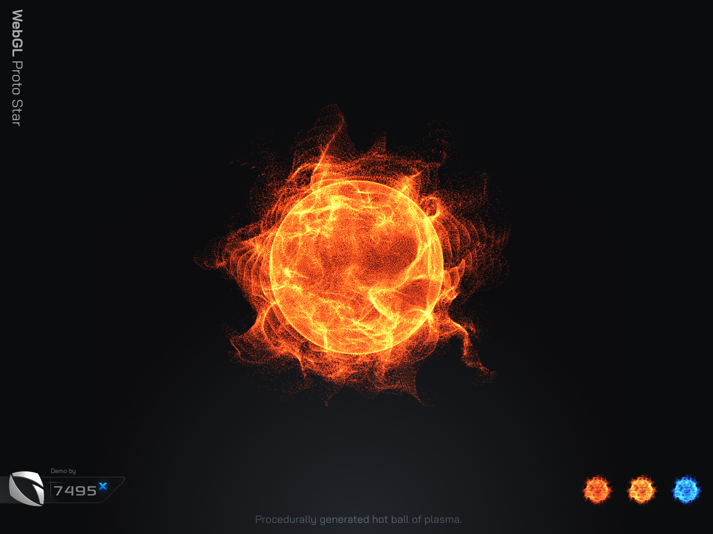
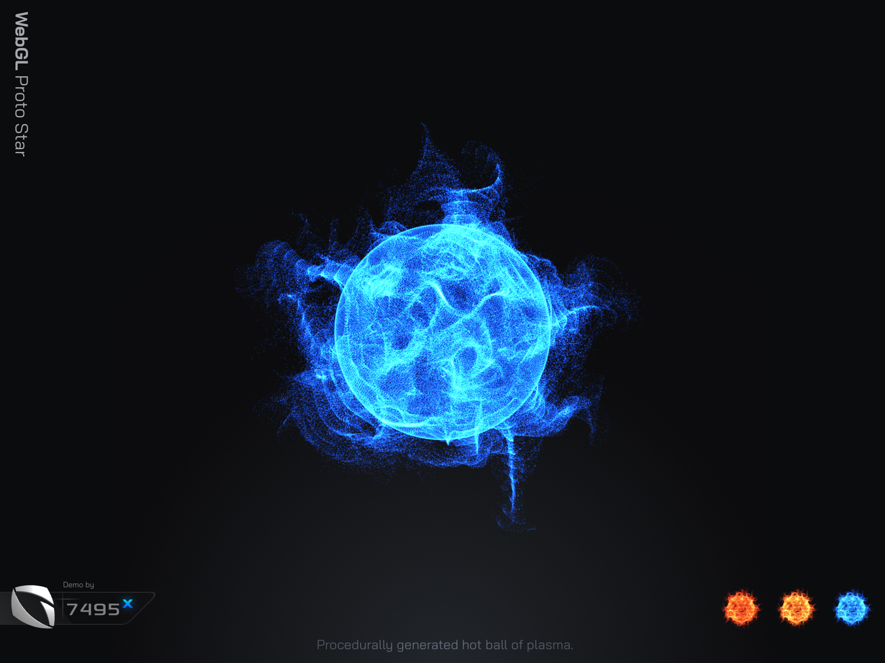

# WebGL Proto Star - Three.js

GPGPU Particle star using Curl over Value Noise.
Achieved via Three.js in WebGL.

Highlights:
- GPGPU via GPUComputationRenderer.js
- Procedurally generated
- 4D Curl Noise over Value Noise
- Fully GPU Optimized
- Fully Customizable via URL Params

Demo - [g7495x.github.io/WebGL-Proto-Star---Three.js/src](https://g7495x.github.io/WebGL-Proto-Star---Three.js/src/)

Demo with Controls - [g7495x.github.io/WebGL-Proto-Star---Three.js/src/?showControls=true](https://g7495x.github.io/WebGL-Proto-Star---Three.js/src/?showControls=true)

To run: `npm start`

